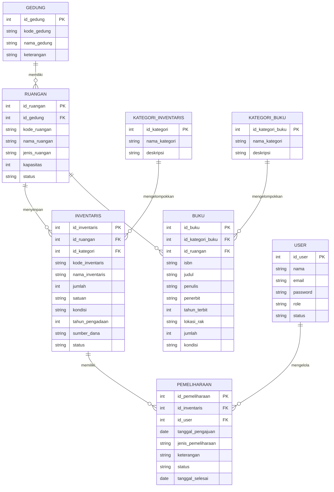
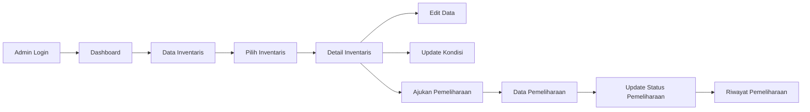
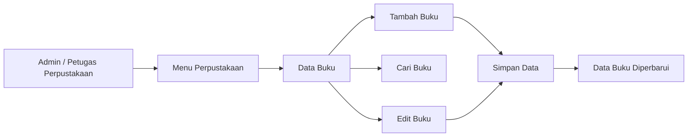

# PERANCANGAN SISTEM INFORMASI

## 1. Identitas Sistem

**Nama Sistem:**
SIMSARPRAS EDU

**Nama Lengkap:**
Sistem Informasi Manajemen Sarana dan Prasarana Pendidikan Berbasis Web

**Topik:**
Sistem Manajemen Sarana dan Prasarana / Asset Management

**Jenis Aplikasi:**
Admin Panel / Back-Office Berbasis Web

**Objek Sistem:**
Institusi Pendidikan, seperti sekolah atau perguruan tinggi.

**Fokus Pengembangan:**
Client-Side Programming

**Penyimpanan Data:**
Mock Data dan LocalStorage

**Konsep UI:**
Material Design dengan pendekatan modern educational admin dashboard.

---

## 2. Deskripsi Sistem

SIMSARPRAS EDU merupakan sistem informasi berbasis web yang dirancang untuk membantu pihak sekolah atau perguruan tinggi dalam mendata, mengelola, dan memantau sarana serta prasarana pendidikan.

Sistem berfokus pada inventaris yang berada di ruang kelas, laboratorium, dan perpustakaan.

Data yang dapat dikelola antara lain meja, kursi, proyektor, komputer, monitor, perangkat jaringan, AC, whiteboard, rak buku, koleksi buku, dan berbagai fasilitas pendidikan lainnya.

Sistem juga menyediakan informasi lokasi barang, kategori inventaris, jumlah, kondisi, tahun pengadaan, sumber dana, status penggunaan, serta riwayat pemeliharaan.

Pengembangan sistem difokuskan pada sisi client tanpa menggunakan database server atau backend. Data aplikasi pada tahap implementasi menggunakan mock data dan dapat disimpan menggunakan LocalStorage.

---

## 3. Latar Belakang

Pengelolaan sarana dan prasarana merupakan bagian penting dalam mendukung kegiatan pendidikan.

Institusi pendidikan memiliki berbagai fasilitas yang tersebar di banyak lokasi, seperti ruang kelas, laboratorium, dan perpustakaan.

Inventaris tersebut perlu didata agar informasi mengenai lokasi, jumlah, kondisi, serta status penggunaannya dapat diketahui dengan jelas.

Pencatatan yang tidak terstruktur dapat menyebabkan kesulitan dalam mengetahui lokasi suatu barang, jumlah inventaris pada setiap ruangan, kondisi barang yang rusak, serta riwayat pemeliharaan.

Oleh karena itu, SIMSARPRAS EDU dirancang sebagai admin panel berbasis web untuk membantu proses pencatatan dan monitoring sarana serta prasarana pendidikan secara lebih terstruktur dan mudah digunakan.

---

## 4. Tujuan Sistem

Tujuan dari pengembangan SIMSARPRAS EDU adalah:

1. Membantu administrator mendata sarana dan prasarana pendidikan.
2. Menyediakan informasi inventaris berdasarkan gedung dan ruangan.
3. Mempermudah pencarian data inventaris.
4. Memantau kondisi inventaris.
5. Mengelola data ruang kelas dan laboratorium.
6. Mengelola data koleksi buku perpustakaan.
7. Menyimpan informasi riwayat pemeliharaan inventaris.
8. Menyediakan dashboard yang menampilkan ringkasan sarana dan prasarana.
9. Membantu pembuatan laporan inventaris secara lebih terstruktur.

---

## 5. Target Pengguna

### Administrator

Administrator bertugas mengelola seluruh data pada sistem.

Hak akses utama:

* Mengelola data gedung.
* Mengelola data ruangan.
* Mengelola kategori inventaris.
* Mengelola data inventaris.
* Mengelola data laboratorium.
* Mengelola data perpustakaan.
* Mengelola data buku.
* Mengelola data kondisi inventaris.
* Mengelola pemeliharaan.
* Melihat laporan.

### Petugas Sarana dan Prasarana

Petugas sarana dan prasarana dapat melakukan monitoring dan pembaruan data inventaris.

### Petugas Perpustakaan

Petugas perpustakaan dapat mengelola data buku dan inventaris yang berada pada area perpustakaan.

---

## 6. Ruang Lingkup Sistem

SIMSARPRAS EDU berfokus pada tiga area utama dalam institusi pendidikan.

### 6.1 Ruang Kelas

Contoh inventaris:

* Kursi mahasiswa/siswa
* Meja mahasiswa/siswa
* Meja dosen/guru
* Kursi dosen/guru
* Proyektor
* AC
* Whiteboard
* Lemari
* Peralatan elektronik

### 6.2 Laboratorium

Contoh inventaris:

* Komputer
* Monitor
* Keyboard
* Mouse
* Router
* Switch
* Projector
* AC
* Meja komputer
* Kursi
* Peralatan laboratorium lainnya

### 6.3 Perpustakaan

Data yang dikelola:

* Koleksi buku
* Kategori buku
* Rak buku
* Meja baca
* Kursi
* Komputer perpustakaan
* Printer
* Inventaris perpustakaan lainnya

---

## 7. Hirarki Data Sistem

Struktur dasar data SIMSARPRAS EDU adalah:

```text
Institusi Pendidikan
│
├── Gedung
│   │
│   ├── Ruang Kelas
│   │   └── Inventaris Ruang Kelas
│   │
│   ├── Laboratorium
│   │   └── Inventaris Laboratorium
│   │
│   └── Perpustakaan
│       ├── Inventaris Perpustakaan
│       └── Koleksi Buku
│
└── Pemeliharaan Inventaris
```

Contoh implementasi:

```text
Gedung A
│
├── Ruang A101
│   ├── 40 Kursi
│   ├── 20 Meja
│   ├── 1 Projector
│   ├── 1 Whiteboard
│   └── 2 AC
│
└── Ruang A102
    ├── 40 Kursi
    ├── 20 Meja
    ├── 1 Projector
    └── 2 AC
```

Contoh laboratorium:

```text
Gedung Laboratorium
│
└── Lab Komputer
    ├── 30 PC
    ├── 30 Monitor
    ├── 30 Keyboard
    ├── 30 Mouse
    ├── 2 Switch
    ├── 1 Router
    ├── 1 Projector
    └── 2 AC
```

---

# 8. Struktur Menu Aplikasi

## Dashboard

Menampilkan ringkasan keseluruhan sarana dan prasarana.

Informasi utama:

* Total inventaris
* Total ruang kelas
* Total laboratorium
* Total buku
* Kondisi inventaris
* Inventaris bermasalah
* Aktivitas terbaru

---

## Data Master

### Gedung

Mengelola data gedung yang tersedia pada institusi pendidikan.

### Ruangan

Mengelola data seluruh ruangan.

Contoh jenis ruangan:

* Ruang Kelas
* Laboratorium
* Perpustakaan
* Ruang Administrasi
* Ruang lainnya

### Kategori Inventaris

Contoh kategori:

* Furnitur
* Elektronik
* Komputer
* Perangkat Jaringan
* Peralatan Laboratorium
* Peralatan Perpustakaan

### Data Inventaris

Mengelola seluruh barang inventaris yang berada pada institusi pendidikan.

---

## Ruang Kelas

### Daftar Ruang Kelas

Menampilkan data ruang kelas.

### Inventaris Ruang Kelas

Menampilkan inventaris berdasarkan ruang kelas.

---

## Laboratorium

### Daftar Laboratorium

Menampilkan data laboratorium.

### Inventaris Laboratorium

Menampilkan inventaris yang berada pada laboratorium.

---

## Perpustakaan

### Data Buku

Mengelola koleksi buku perpustakaan.

### Kategori Buku

Mengelola kategori buku.

### Inventaris Perpustakaan

Mengelola barang inventaris yang berada di perpustakaan.

---

## Kondisi Inventaris

Kondisi inventaris terdiri dari:

* Baik
* Rusak Ringan
* Rusak Berat
* Dalam Perbaikan

---

## Pemeliharaan

### Pengajuan Perbaikan

Mencatat inventaris yang membutuhkan perbaikan.

### Riwayat Pemeliharaan

Menampilkan histori pemeliharaan inventaris.

---

## Laporan

Laporan yang tersedia:

* Laporan Inventaris
* Laporan Kondisi Barang
* Laporan Ruangan
* Laporan Laboratorium
* Laporan Buku
* Laporan Pemeliharaan

---

## Pengguna

Mengelola pengguna aplikasi.

---

## Pengaturan

Mengatur konfigurasi dasar aplikasi.

---

# 9. Struktur Navigasi

```mermaid
flowchart TD

    A[Dashboard]

    A --> B[Data Master]
    A --> C[Ruang Kelas]
    A --> D[Laboratorium]
    A --> E[Perpustakaan]
    A --> F[Kondisi Inventaris]
    A --> G[Pemeliharaan]
    A --> H[Laporan]
    A --> I[Pengguna]
    A --> J[Pengaturan]

    B --> B1[Gedung]
    B --> B2[Ruangan]
    B --> B3[Kategori Inventaris]
    B --> B4[Data Inventaris]

    C --> C1[Daftar Ruang Kelas]
    C --> C2[Inventaris Ruang Kelas]

    D --> D1[Daftar Laboratorium]
    D --> D2[Inventaris Laboratorium]

    E --> E1[Data Buku]
    E --> E2[Kategori Buku]
    E --> E3[Inventaris Perpustakaan]

    F --> F1[Baik]
    F --> F2[Rusak Ringan]
    F --> F3[Rusak Berat]
    F --> F4[Dalam Perbaikan]

    G --> G1[Pengajuan Perbaikan]
    G --> G2[Riwayat Pemeliharaan]

    H --> H1[Laporan Inventaris]
    H --> H2[Laporan Kondisi]
    H --> H3[Laporan Ruangan]
    H --> H4[Laporan Buku]
```



---

# 10. Entity Relationship Diagram

ERD berikut menggambarkan hubungan antarentitas utama dalam SIMSARPRAS EDU.



---

# 11. Penjelasan Entitas

## GEDUNG

Menyimpan informasi gedung yang terdapat pada institusi pendidikan.

Contoh:

* Gedung A
* Gedung B
* Gedung Laboratorium
* Gedung Perpustakaan

---

## RUANGAN

Menyimpan data ruangan yang berada pada setiap gedung.

Contoh:

* Ruang A101
* Ruang A102
* Lab Komputer
* Lab Jaringan
* Perpustakaan

---

## KATEGORI_INVENTARIS

Digunakan untuk mengelompokkan inventaris.

Contoh:

* Furnitur
* Elektronik
* Komputer
* Perangkat Jaringan
* Peralatan Laboratorium

---

## INVENTARIS

Menyimpan data barang atau sarana dan prasarana yang tersedia.

Informasi inventaris meliputi:

* Kode inventaris
* Nama inventaris
* Lokasi
* Kategori
* Jumlah
* Kondisi
* Tahun pengadaan
* Sumber dana
* Status

---

## PEMELIHARAAN

Menyimpan riwayat pengajuan maupun proses pemeliharaan inventaris.

Contoh:

* Perbaikan projector
* Service AC
* Penggantian keyboard
* Perbaikan komputer laboratorium

---

## KATEGORI_BUKU

Digunakan untuk mengelompokkan koleksi perpustakaan.

Contoh:

* Informatika
* Ekonomi
* Pendidikan
* Matematika
* Umum

---

## BUKU

Menyimpan data koleksi buku perpustakaan.

Informasi meliputi:

* ISBN
* Judul
* Penulis
* Penerbit
* Tahun terbit
* Rak
* Jumlah
* Kondisi

---

## USER

Digunakan untuk menyimpan data pengguna aplikasi.

Contoh role:

* Administrator
* Petugas Sarana Prasarana
* Petugas Perpustakaan

---

# 12. User Flow Utama



---

### Alur Masuk dan Keluar (Login/Logout)

Halaman login (`login.html`) menggunakan akun demo `admin` / `Demo123!` sebagai
simulasi client-side (bukan autentikasi aman). Setelah login berhasil, penanda sesi
disimpan di `sessionStorage` (key `simsarpras.session.v1`); halaman dashboard, data
inventaris, form, dan laporan memeriksa sesi dan mengarahkan ke halaman login bila
tidak ada. Tombol **Keluar** menghapus penanda sesi dan kembali ke halaman login.

# 13. User Flow Pengelolaan Buku



---

# 14. Konsep Dashboard

Dashboard SIMSARPRAS EDU akan menampilkan informasi utama seperti:

### Statistik

* Total Inventaris
* Total Ruang Kelas
* Total Laboratorium
* Total Koleksi Buku

### Grafik Inventaris Berdasarkan Lokasi

Menampilkan distribusi inventaris pada:

* Ruang Kelas
* Laboratorium
* Perpustakaan

### Grafik Kondisi Inventaris

Menampilkan perbandingan:

* Baik
* Rusak Ringan
* Rusak Berat
* Dalam Perbaikan

### Inventaris Perlu Perhatian

Menampilkan inventaris yang mengalami kerusakan.

Contoh:

| Inventaris      | Lokasi       | Kondisi         |
| --------------- | ------------ | --------------- |
| Projector Epson | Ruang A103   | Rusak Ringan    |
| PC Lenovo 04    | Lab Komputer | Rusak Berat     |
| AC Panasonic    | Lab Jaringan | Dalam Perbaikan |

### Aktivitas Terbaru

Menampilkan aktivitas terbaru sistem seperti:

* Inventaris baru ditambahkan
* Kondisi barang diperbarui
* Pemeliharaan diajukan
* Pemeliharaan selesai
* Buku baru ditambahkan

---

# 15. Konsep Halaman Data Master Inventaris

Halaman Data Inventaris akan menjadi salah satu halaman utama sistem.

Informasi tabel:

| Field           | Deskripsi                |
| --------------- | ------------------------ |
| Kode Inventaris | Kode unik barang         |
| Nama Inventaris | Nama barang              |
| Kategori        | Jenis inventaris         |
| Gedung          | Gedung tempat inventaris |
| Ruangan         | Lokasi inventaris        |
| Jumlah          | Jumlah barang            |
| Kondisi         | Kondisi barang           |
| Tahun Pengadaan | Tahun diperoleh          |
| Sumber Dana     | Sumber pembelian         |
| Status          | Status penggunaan        |

Fitur client-side yang direncanakan:

* Pencarian
* Filter gedung
* Filter ruangan
* Filter kategori
* Filter kondisi
* Sorting
* Pagination
* Tambah inventaris
* Edit inventaris
* Hapus inventaris
* Detail inventaris

---

# 16. Design System

## Tema Visual

Material Design dengan pendekatan modern educational administration dashboard.

Mendukung mode terang (default) dan mode gelap. Pilihan tema disimpan di
`localStorage` (key `simsarpras.theme.v1`); bila belum ada pilihan, mengikuti
preferensi sistem (`prefers-color-scheme`). Tombol tema tersedia di header setiap
halaman dan dapat digunakan dengan keyboard.

## Typography

Font utama:

**Plus Jakarta Sans**

Alternatif:

**Inter**

## Color Palette

Primary:

`#2563EB`

Background:

`#F7F8FA`

Surface:

`#FFFFFF`

Primary Text:

`#111827`

Secondary Text:

`#6B7280`

Border:

`#E5E7EB`

Success:

`#16A34A`

Warning:

`#D97706`

Danger:

`#DC2626`

## Status Kondisi

Baik:

`Success`

Rusak Ringan:

`Warning`

Rusak Berat:

`Danger`

Dalam Perbaikan:

`Information / Blue`

---

# 17. Komponen UI

Komponen reusable yang akan digunakan:

* Sidebar
* Top Navigation
* Breadcrumb
* Button
* Input
* Select
* Search
* Card
* Statistic Card
* Table
* Status Badge
* Modal
* Drawer
* Pagination
* Toast Notification
* Confirmation Dialog
* Empty State
* Loading Skeleton
* Chart

---

# 18. Tools

Tools yang digunakan dalam perancangan dan pengembangan:

* Google Stitch
* Figma
* Visual Studio Code
* Google Antigravity

---

# 19. Teknologi Implementasi

Rencana teknologi frontend:

* React
* TypeScript
* Vite
* Tailwind CSS
* LocalStorage
* Mock Data

Sistem tidak menggunakan backend maupun database server pada tahap tugas Client-Side Programming.

---

# 20. Wireframe

## Dashboard

Screenshot hasil wireframe Google Stitch / Figma akan dimasukkan pada bagian ini.


## Data Master Inventaris


# 21. High-Fidelity Design

## Dashboard


## Data Master Inventaris


## Design System


---

# 22. Link Project Design

**Google Stitch:**
https://stitch.withgoogle.com/projects/676842341148351441

**Figma:**
(https://www.figma.com/design/YLoLjr6Ejf5xEK6rdPDNKY/SIMSAARPRAS-UNPAM---Milestone-1?node-id=0-1&t=Erg2vNqYIqaOPzQt-1)

---

# 23. Kesimpulan Perancangan

SIMSARPRAS EDU dirancang sebagai sistem informasi berbasis web untuk membantu institusi pendidikan dalam melakukan pengelolaan sarana dan prasarana secara terstruktur.

Sistem berfokus pada pengelolaan inventaris yang berada pada ruang kelas, laboratorium, dan perpustakaan.

Melalui dashboard, data master, monitoring kondisi, pengelolaan koleksi buku, serta pencatatan pemeliharaan, administrator dapat memperoleh informasi sarana dan prasarana secara lebih mudah dan terorganisir.

Pada tahap implementasi Client-Side Programming, aplikasi akan dikembangkan menggunakan data simulasi atau mock data tanpa menggunakan backend dan database server.